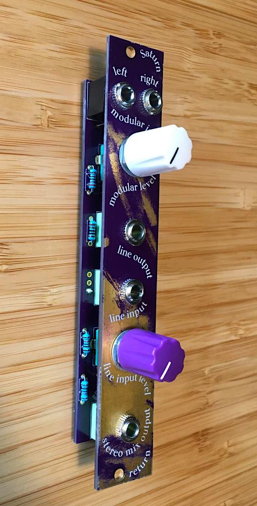
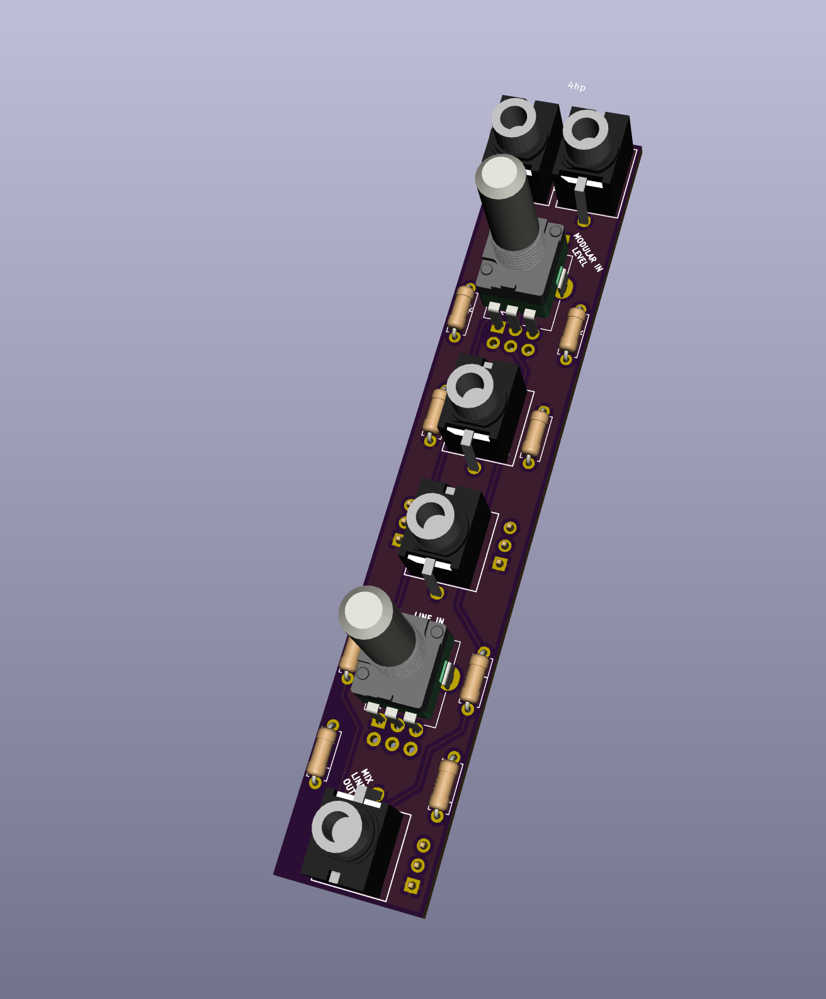
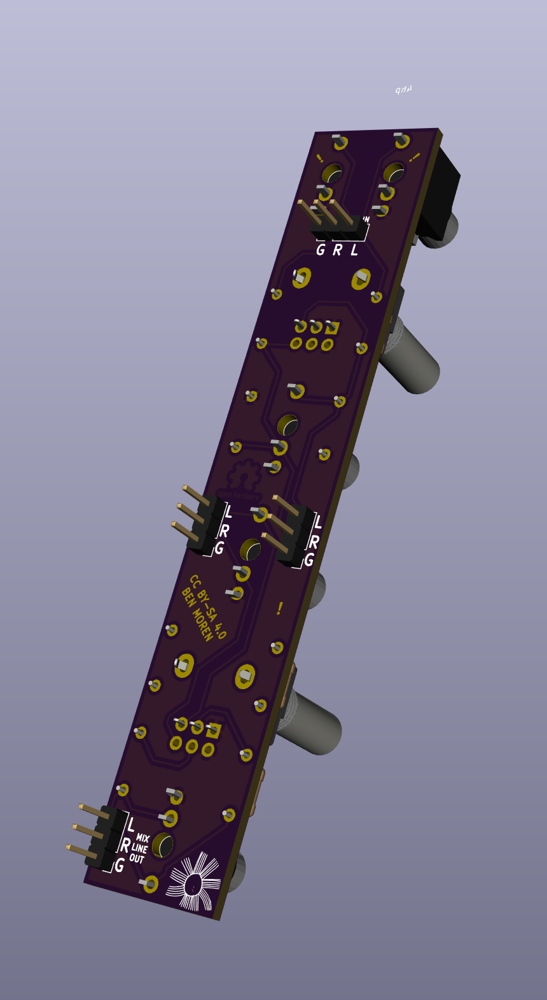
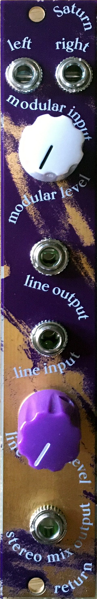

# saturn-return
Send transmissions, listen for communication

Modular level > stereo line out &amp; stereo aux send mixer (a friend of norns)
4hp

Modular Left and Right signals are fed through a voltage divider, tuned, and sent out into space.      
Transmissions are received as stereo line signals.     
Transmissions are tuned and combined with signals (for recording and archiving).    

An module and idea based on [discussion in the norns I/O thread](https://llllllll.co/t/norns-audio-in-out-specs/30256/37?u=bmoren)

[View it on ModularGrid](https://www.modulargrid.net/e/other-unknown-saturn-return)

## I/O

Inputs:
+ L/R modular level signals
+ Line input

Outputs: 
+ Stereo line output
+ Stereo mix line output (mixed inputs)

Knobs:
+ Level control for modular input to mix
+ Level control for line input to mix

## Build Instructions
1. (optional advanced preperation – use your multimeter to find matched resistor values R3=R7, R4=R8, R1=R2=R5=R6 )
1. Start with the resistors, place them into the footrpints
1. Solder resistors, clip the legs
1. Place jacks and pots into the footprints. * do not solder them yet!
1. Place the panel on, screw down jacks and pots to the panel (this will align everything)
1. finally solder the jacks and panels
1. attach knobs
1. done!

## license 

CC BY-SA 4.0     
Build and use at your own risk! I am not responsible for any damage to self or otherwise that arises from using this project!
