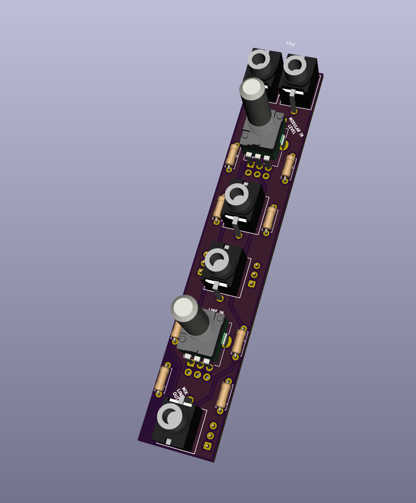
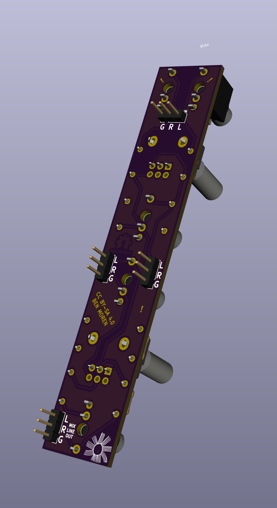
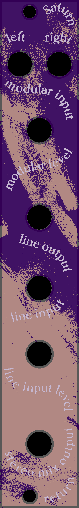

# saturn-return
Modular level > stereo line out &amp; stereo aux send mixer (a friend of norns)
4hp

[View it on ModularGrid](https://www.modulargrid.net/e/other-unknown-saturn-return)

Inputs:
+ L/R modular level signals
+ Line input

Outputs: 
+ Stereo line output
+ Stereo mix line output (mixed inputs)

Knobs:
+ Level control for modular input to mix
+ Level control for line input to mix

---

CC BY-SA 4.0     
Build and use at your own risk! I am not responsible for any damage to self or otherwise that arises from using this project!
